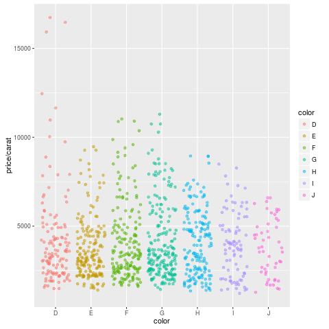

<!DOCTYPE html>
<head>
    <meta charset="utf-8">
<meta http-equiv="X-UA-Compatible" content="IE=edge">
<meta name="viewport" content="width=device-width, initial-scale=1">
<meta name="description" content="">
<meta name="keywords" content=" ">
<title>My First R Markdown Document | Jekyll theme for documentation</title>
<link rel="stylesheet" href="css/syntax.css">


<link rel="stylesheet" type="text/css" href="https://maxcdn.bootstrapcdn.com/font-awesome/4.5.0/css/font-awesome.min.css">
<!--<link rel="stylesheet" type="text/css" href="css/bootstrap.min.css">-->
<link rel="stylesheet" href="css/modern-business.css">
<link rel="stylesheet" href="css/lavish-bootstrap.css">
<link rel="stylesheet" href="css/customstyles.css">
<link rel="stylesheet" href="css/theme-blue.css">

<script src="https://cdnjs.cloudflare.com/ajax/libs/jquery/2.1.4/jquery.min.js"></script>
<script src="https://cdnjs.cloudflare.com/ajax/libs/jquery-cookie/1.4.1/jquery.cookie.min.js"></script>
<script src="js/jquery.navgoco.min.js"></script>


<script src="https://maxcdn.bootstrapcdn.com/bootstrap/3.3.4/js/bootstrap.min.js"></script>
<script src="https://cdnjs.cloudflare.com/ajax/libs/anchor-js/2.0.0/anchor.min.js"></script>
<script src="js/toc.js"></script>
<script src="js/customscripts.js"></script>

<link rel="shortcut icon" href="images/favicon.ico">

<!-- HTML5 Shim and Respond.js IE8 support of HTML5 elements and media queries -->
<!-- WARNING: Respond.js doesn't work if you view the page via file:// -->
<!--[if lt IE 9]>
<script src="https://oss.maxcdn.com/libs/html5shiv/3.7.0/html5shiv.js"></script>
<script src="https://oss.maxcdn.com/libs/respond.js/1.4.2/respond.min.js"></script>
<![endif]-->

<link rel="alternate" type="application/rss+xml" title="" href="feed.xml">

    <script>
        $(document).ready(function() {
            // Initialize navgoco with default options
            $("#mysidebar").navgoco({
                caretHtml: '',
                accordion: true,
                openClass: 'active', // open
                save: false, // leave false or nav highlighting doesn't work right
                cookie: {
                    name: 'navgoco',
                    expires: false,
                    path: '/'
                },
                slide: {
                    duration: 400,
                    easing: 'swing'
                }
            });

            $("#collapseAll").click(function(e) {
                e.preventDefault();
                $("#mysidebar").navgoco('toggle', false);
            });

            $("#expandAll").click(function(e) {
                e.preventDefault();
                $("#mysidebar").navgoco('toggle', true);
            });

        });

    </script>
    <script>
        $(function () {
            $('[data-toggle="tooltip"]').tooltip()
        })
    </script>
    

</head>
<body>
<!-- Navigation -->
<nav class="navbar navbar-inverse navbar-fixed-top">
    <div class="container topnavlinks">
        <div class="navbar-header">
            <button type="button" class="navbar-toggle" data-toggle="collapse" data-target="#bs-example-navbar-collapse-1">
                <span class="sr-only">Toggle navigation</span>
                <span class="icon-bar"></span>
                <span class="icon-bar"></span>
                <span class="icon-bar"></span>
            </button>
            <a class="fa fa-home fa-lg navbar-brand" href="index.html">&nbsp;<span class="projectTitle"> Jekyll Documentation Theme</span></a>
        </div>
        <div class="collapse navbar-collapse" id="bs-example-navbar-collapse-1">
            <ul class="nav navbar-nav navbar-right">
                <!-- entries without drop-downs appear here -->
                
                
                
                <li><a href="news">News</a></li>
                
                
                
                <!-- entries with drop-downs appear here -->
                <!-- conditional logic to control which topnav appears for the audience defined in the configuration file.-->
                
                
                <li class="dropdown">
                    <a href="#" class="dropdown-toggle" data-toggle="dropdown">Jekyll Resources<b class="caret"></b></a>
                    <ul class="dropdown-menu">
                        
                        
                        <li><a href="https://github.com/tomjohnson1492/documentation-theme-jekyll" target="_blank">Github Repo</a></li>
                        
                        
                        
                        <li><a href="https://talk.jekyllrb.com" target="_blank">Jekyll Talk</a></li>
                        
                        
                        
                        <li><a href="http://jekyllrb.com/docs/home/" target="_blank">Jekyll documentation</a></li>
                        
                        
                        
                        <li><a href="http://stackoverflow.com/questions/tagged/jekyll" target="_blank">Jekyll on Stack Overflow</a></li>
                        
                        
                        
                        <li><a href="http://idratherbewriting.com/category-jekyll/" target="_blank">Jekyll on my blog</a></li>
                        
                        
                    </ul>
                </li>
                
                <li class="dropdown">
                    <a href="#" class="dropdown-toggle" data-toggle="dropdown">Products<b class="caret"></b></a>
                    <ul class="dropdown-menu">
                        
                        
                        <li><a href="mydoc_introduction.html">Jekyll Documentation Theme</a></li>
                        
                        
                        
                        <li><a href="p1_landing_page.html">Product 1</a></li>
                        
                        
                        
                        <li><a href="p2_landing_page.html">Product 2</a></li>
                        
                        
                    </ul>
                </li>
                
                
                
			<!-- Send feedback function -->
<script>
function SendLinkByMail(href) {
var subject= "Jekyll theme for documentation feedback";
var body = "I have some feedback about the My First R Markdown Document page: ";
body += window.location.href;
body += "";
var uri = "mailto:tomjohnson1492@gmail.com?subject=";
uri += encodeURIComponent(subject);
uri += "&body=";
uri += encodeURIComponent(body);
window.location.href = uri;
}
</script>

<li><a href="javascript:(function()%7BSendLinkByMail()%3B%7D)()%3B" target="_blank"><i class="fa fa-envelope-o"></i> Feedback</a></li>

		
                <!--comment out this block if you want to hide search-->
                <li>
                    <!--start search-->
                    <div id="search-demo-container">
                        <input type="text" id="search-input" placeholder="search...">
                        <ul id="results-container"></ul>
                    </div>
                    <script src="js/jekyll-search.js" type="text/javascript"></script>
                    <script type="text/javascript">
                            SimpleJekyllSearch.init({
                                searchInput: document.getElementById('search-input'),
                                resultsContainer: document.getElementById('results-container'),
                                dataSource: '../search.json',
                                searchResultTemplate: '<li><a href="{url}" title="My First R Markdown Document">{title}</a></li>',
                    noResultsText: 'No results found.',
                            limit: 10,
                            fuzzy: true,
                    })
                    </script>
                    <!--end search-->
                </li>
            </ul>
        </div>
        </div>
        <!-- /.container -->
</nav>

<!-- Page Content -->
<div class="container">
    <div class="col-lg-12">&nbsp;</div>
    <!-- Content Row -->
    <div class="row">
        <!-- Sidebar Column -->
        <div class="col-md-3">

          


<ul id="mysidebar" class="nav">
    <li class="sidebarTitle"> </li>
    
    
    
    <li>
        <a href="#">Products</a>
        <ul>
            
            
            
            <li><a href="news.html">News</a></li>
            
            
            
            
            
            
            <li><a href="mydoc_introduction.html">Theme instructions</a></li>
            
            
            
            
            
            
            <li><a href="p1_landing_page.html">Product 1</a></li>
            
            
            
            
            
            
            <li><a href="p2_landing_page.html">Product 2</a></li>
            
            
            
            
        </ul>
        
        
        
        <!-- if you aren't using the accordion, uncomment this block:
           <p class="external">
               <a href="#" id="collapseAll">Collapse All</a> | <a href="#" id="expandAll">Expand All</a>
           </p>
           -->
    </li>
</ul>
</div>

<!-- this highlights the active parent class in the navgoco sidebar. this is critical so that the parent expands when you're viewing a page. This must appear below the sidebar code above. Otherwise, if placed inside customscripts.js, the script runs before the sidebar code runs and the class never gets inserted.-->
<script>$("li.active").parents('li').toggleClass("active");</script>

    <!-- Content Column -->
    <div class="col-md-9">
        <div class="post-header">
   <h1 class="post-title-main">My First R Markdown Document</h1>
</div>


<div class="post-content">

   

    
    
<!-- this handles the automatic toc. use ## for subheads to auto-generate the on-page minitoc. if you use html tags, you must supply an ID for the heading element in order for it to appear in the minitoc. -->
<script>
$( document ).ready(function() {
  // Handler for .ready() called.

$('#toc').toc({ minimumHeaders: 0, listType: 'ul', showSpeed: 0, headers: 'h2,h3,h4' });

/* this offset helps account for the space taken up by the floating toolbar. */
$('#toc').on('click', 'a', function() {
  var target = $(this.getAttribute('href'))
    , scroll_target = target.offset().top

  $(window).scrollTop(scroll_target - 10);
  return false
})
  
});
</script>

<div id="toc"></div>

    

    

    

    <a target="_blank" href="https://github.com/tomjohnson1492/documentation-theme-jekyll/blob/gh-pages/_pages//_pages//vignettes07_Rbasicssample.Rmd.md" class="btn btn-default githubEditButton" role="button"><i class="fa fa-github fa-lg"></i> Edit me</a>
    

    

  # Render `Rmd` script

An R Markdown script can be evaluated and rendered with the following `render` command or by pressing the `knit` button in RStudio.
The `output_format` argument defines the format of the output (_e.g._ `html_document`). The setting `output_format="all"` will generate 
all supported output formats. Alternatively, one can specify several output formats in the metadata section as shown in the above example.

```{r render_rmarkdown, eval=FALSE, message=FALSE}
rmarkdown::render("sample.Rmd", clean=TRUE, output_format="html_document")
```

The following shows how to run the rendering from the command-line.

```{sh render_commandline, eval=FALSE, message=FALSE}
$ echo "rmarkdown::render('sample.Rmd', clean=TRUE, output_format='html_document')" | R --slave
```

# R code chunks

R Code Chunks can be embedded in an R Markdown script by using three backticks
at the beginning of a new line along with arguments enclosed in curly braces
controlling the behavior of the code. The following lines contain the
plain R code. A code chunk is terminated by a new line starting with three backticks.
The following shows an example of such a code chunk. Note the backslashes are
not part of it. They have been added to print the code chunk syntax in this document.

```
	```\{r code_chunk_name, eval=FALSE\}
	x <- 1:10
	```
```

The following lists the most important arguments to control the behavior of R code chunks:

+ `r`: specifies language for code chunk, here R
+ `chode_chunk_name`: name of code chunk; this name needs to be unique
+ `eval`: if assigned `TRUE` the code will be evaluated
+ `warning`: if assigned `FALSE` warnings will not be shown
+ `message`: if assigned `FALSE` messages will not be shown
+ `cache`: if assigned `TRUE` results will be cached to reuse in future rendering instances
+ `fig.height`: allows to specify height of figures in inches
+ `fig.width`: allows to specify width of figures in inches

For more details on code chunk options see [here](https://www.rstudio.com/wp-content/uploads/2015/03/rmarkdown-reference.pdf).


## Learning Markdown

The basic syntax of Markdown and derivatives like kramdown is extremely easy to learn. Rather
than providing another introduction on this topic, here are some useful sites for learning Markdown:

+ [Markdown Intro on GitHub](https://guides.github.com/features/mastering-markdown/)
+ [Markdown Cheet Sheet](https://github.com/adam-p/markdown-here/wiki/Markdown-Cheatsheet)
+ [Markdown Basics from RStudio](http://rmarkdown.rstudio.com/authoring_basics.html) 
+ [R Markdown Cheat Sheet](http://www.rstudio.com/wp-content/uploads/2015/02/rmarkdown-cheatsheet.pdf)
+ [kramdown Syntax](http://kramdown.gettalong.org/syntax.html)

## Tables

There are several ways to render tables. First, they can be printed within the R code chunks. Second, 
much nicer formatted table can be generated with the functions `kable`, `pander` or `xtable`. The following
example uses `kable` from the `knitr` package.

```{r kable}
library(knitr)
kable(iris[1:12,])
```

# Figures

Plots generated by the R code chunks in an R Markdown document can be automatically 
inserted in the output file. The size of the figure can be controlled with the `fig.height`
and `fig.width` arguments.

```{r some_jitter_plot, eval=TRUE}
library(ggplot2)
dsmall <- diamonds[sample(nrow(diamonds), 1000), ]
ggplot(dsmall, aes(color, price/carat)) + geom_jitter(alpha = I(1 / 2), aes(color=color))
```

Sometimes it can be useful to explicitly write an image to a file and then insert that 
image into teh fianl document by referencing its file name in the R Markdown source. For 
instance, this can be useful for time consuming analyses. The following code will generate 
a file named `myplot.png`. To insert the file in the final document, one can use standard 
Markdown or HTML syntax, _e.g._: ``.  

```{r some_custom_inserted_plot, eval=TRUE, warning=FALSE, message=FALSE}
png("myplot.png")
ggplot(dsmall, aes(color, price/carat)) + geom_jitter(alpha = I(1 / 2), aes(color=color))
dev.off()
```
<center></center>

# Inline R code

To evaluate R code inline, one can enclose an R expression with a single back-tick
followed by `r` and then the actual expression.  For instance, the back-ticked version 
of 'r 1 + 1' evaluates to `r 1 + 1` and 'r pi' evaluates to `r pi`.

# Mathematical equations

To render mathematical equations, one can use standard Latex syntax. When expressions are 
enclosed with single `$` signs then they will be shown inline, while 
enclosing them with double `$$` will show them in display mode. For instance, the following 
Latex syntax `d(X,Y) = \sqrt[]{ \sum_{i=1}^{n}{(x_{i}-y_{i})^2} }` renders in display mode as follows:

$$d(X,Y) = \sqrt[]{ \sum_{i=1}^{n}{(x_{i}-y_{i})^2} }$$

# Citations and bibliographies

Citations and bibliographies can be autogenerated in R Markdown in a similar
way as in Latex/Bibtex. Reference collections should be stored in a separate
file in Bibtex or other supported formats. To cite a publication in an R Markdown 
script, one uses the syntax `[@<id1>]` where `<id1>` needs to be replaced with a 
reference identifier present in the Bibtex database listed in the metadata section 
of the R Markdown script  (_e.g._ `bibtex.bib`). For instance, to cite Lawrence et al. 
(2013), one  uses its reference identifier (_e.g._ `Lawrence2013-kt`) as `<id1>` [@Lawrence2013-kt]. 
This will place the citation inline in the text and add the corresponding
reference to a reference list at the end of the output document. For the latter a 
special section called `References` needs to be specified at the end of the R Markdown script.
To fine control the formatting of citations and reference lists, users want to consult this 
the corresponding [R Markdown page](http://rmarkdown.rstudio.com/authoring_bibliographies_and_citations.html).
Also, for general reference management and outputting references in Bibtex format [Paperpile](https://paperpile.com/features) 
can be very helpful.

# Session Info

```{r sessionInfo}
sessionInfo()
```

# References


<div class="tags">
    
</div>

    

</div>

<hr class="shaded"/>

<footer>
            <div class="row">
                <div class="col-lg-12 footer">
               &copy;2016 Your company. All rights reserved. <br />
 Site last generated: Jul 10, 2016 <br />
<p></p>
                </div>
            </div>
</footer>


    </div>
    <!-- /.row -->
</div>
<!-- /.container -->
    </div>
    <script>
    jQuery(function ($) {
        $('.post-content').annotator()
                .annotator('setupPlugins', {tokenUrl: 'http://example.com/api/token'})
    });
    </script>
</body>

</html>